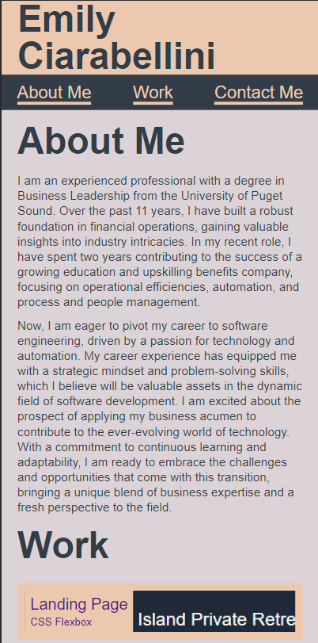
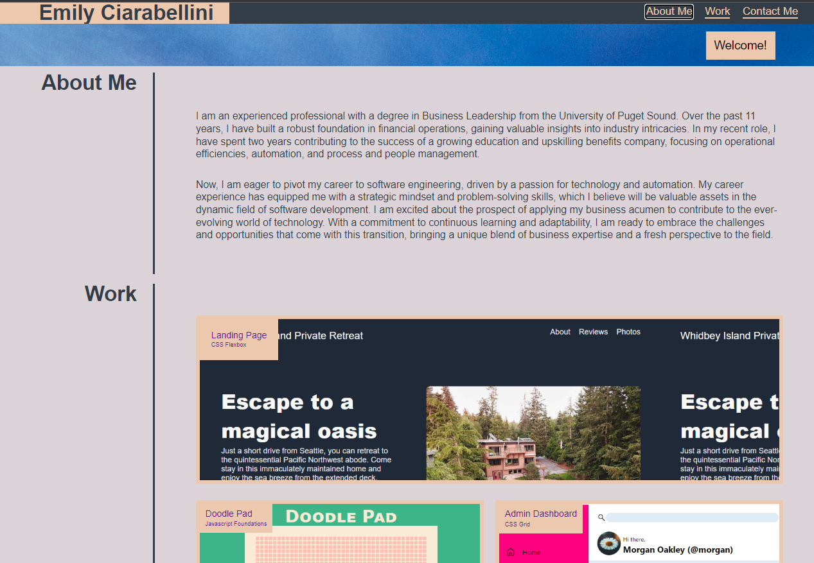

# professional-portfolio

## Description

This is a portfolio of work to showcase projects that I have completed during my journey to becoming a software engineer. The motivation behind this is to practice and showcase the skills that I learned during The Odin Project coursework as well as the Michigan State Univeristy Coding Bootcamp.

In building this webpage, I learned about designing with a mobile-first methodology. I have two formats: one for screen sizes with a width of 992px or smaller (mobile devices) and another for screens larger than 992px.

## Installation

None

## Usage
Click the navigation links at the top of the page to jump to the related section. The welcome banner is hidden in mobile version and present in the desktop version.

View of page in mobile:

View of page in desktop:

    

## Credits
File reset.css copied from 28-Stu_Mini-Project in class coursework found [here](https://git.bootcampcontent.com/Michigan-State-University/MSU-VIRT-FSF-PT-11-2023-U-LOLC)

Greeting photo by <a href="https://unsplash.com/@quinoal?utm_content=creditCopyText&utm_medium=referral&utm_source=unsplash">Quino Al</a> on <a href="https://unsplash.com/photos/body-of-water-and-seashore-JFeOy62yjXk?utm_content=creditCopyText&utm_medium=referral&utm_source=unsplash">Unsplash</a>

The wireframe design for this page was provided by the Bootcamp coursework.

## License

MIT License